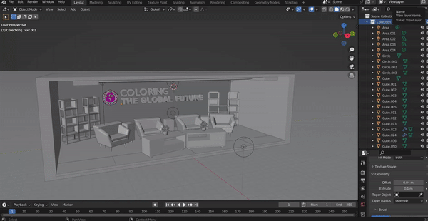

# Shooting Room UG TV with Blender

## DOWNLOAD PROJECT

**GROUP NAME:**
AQSHA NASUTION (50420212)
ASKA PRAMANDA TANTO (51420338)
BRIAN RIAN REHAN (50420296)

**Table of Contents**
Introduction
Initial Preparation
Creating the Room Model
Lighting and Material Settings
Adding Objects and TV Equipment
Camera Animation
Render Setup
Conclusion

**1. Introduction**
The virtual UG TV shooting space allows you to create an interactive and realistic television studio. With Blender, you can design the room, add TV equipment, and easily adjust the lighting.

**2. Initial Preparation**
Before starting, ensure you have installed Blender and have a basic understanding of its usage. Also, gather references for the UG TV shooting space to enhance your design.

**3. Creating the Room Model**
Begin by creating a model of the room that will be used for UG TV shooting. Utilize Blender's modeling tools to craft the walls, floor, and ceiling of the room. Pay attention to proportions and scale to achieve a realistic appearance.

**4. Lighting and Material Settings**
Lighting plays a crucial role in setting the atmosphere in the shooting space. Use Blender's lighting features to define the light source and its intensity. You can also adjust material settings to make objects in the room appear as desired.

**5. Adding Objects and TV Equipment**
Incorporate objects such as tables, chairs, cameras, microphones, monitors, and other TV equipment into the room. Ensure these objects are well-placed and meet the requirements of TV production.

**6. Camera Animation**
Create camera animations to provide dynamic perspectives within the room. You can make the camera move, zoom, or follow the movement of objects in the space. Explore different angles to achieve compelling results.

**7. Render Setup**
Before initiating the rendering process, specify rendering settings according to your needs. Choose resolution, file format, and other settings to ensure the rendered output meets expectations.

**8. Conclusion**
In this guide, we have discussed the fundamental steps for creating a UG TV shooting space with Blender. From crafting the room model to adding objects and camera animation, you can create a realistic and interactive shooting space.
